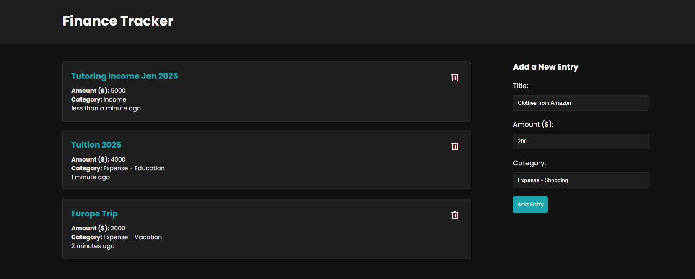
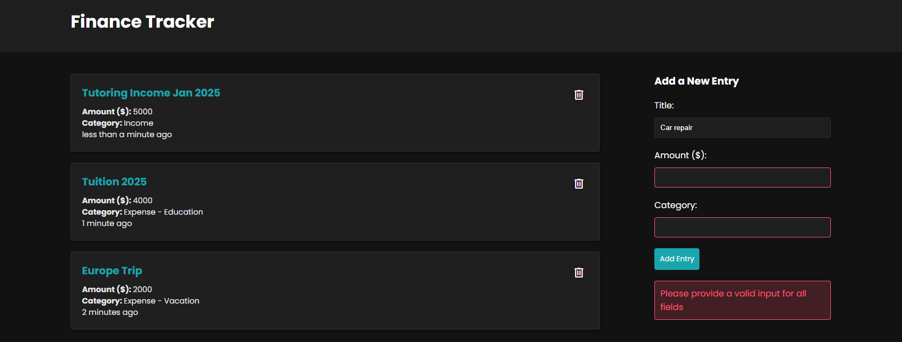

# Finance Tracker

Finance Tracker is a personal budgeting and expense-tracking web application built using the MERN (MongoDB, Express.js, React.js, Node.js) stack. It allows users to manage their income and expenses by adding, categorizing, and viewing financial transactions.

---

## Features

- **Add Transactions:** Record income or expenses with a title, amount, and category.
- **View Transactions:** Display all financial entries in a card-based layout with details such as title, amount, category, and a timestamp.
- **Delete Transactions:** Remove individual entries with a simple click of the delete button.
- **Categories:** Organize your transactions using custom categories (e.g., Income, Education, Vacation, Shopping).
- **User-Friendly Interface:** Clean, responsive, and easy-to-navigate interface built with React.

---

## Screenshots

<!--  -->

---

## Tech Stack

### Frontend:
- **React.js**: For building the user interface.

### Backend:
- **Node.js**: Server-side JavaScript runtime.
- **Express.js**: Lightweight backend framework for building APIs.
- **MongoDB**: NoSQL database for storing financial transactions.

---

## Installation

### Prerequisites:
- Node.js and npm installed
- MongoDB running locally or on a cloud service like MongoDB Atlas

### Steps:
1. Clone this repository

2. Install dependencies for both backend and frontend:
   ```bash
   # Backend dependencies
   cd backend
   npm install

   # Frontend dependencies
   cd frontend
   npm install
   ```

3. Set up environment variables:
   Create a `.env` file in the `backend` directory with the following:
   ```
   MONGO_URI=<your-mongodb-connection-string>
   PORT=5000
   ```

4. Start the application:
   ```bash
   # Start backend server
   cd backend
   npm run dev

   # Start frontend React app
   cd frontend
   npm start
   ```

5. Open the app in your browser:
   ```
   http://localhost:3000
   ```

---

